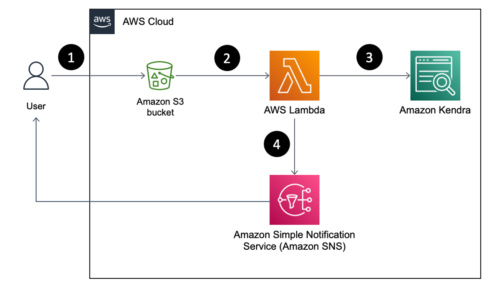

# Amazon Kendra FAQ Refresher
Amazon Kendra is an intelligent search service powered by machine learning (ML). Kendra
reimagines enterprise search for your websites and applications so your employees and
customers can easily find the content they’re looking for, even when it’s scattered across
multiple locations and content repositories within your organization.

This solution hosts an AWS Lambda Function which is configured to get triggered by an Amazon
S3 Event Notification. When you upload a FAQ to the Amazon S3 folder mapped to a specific
Amazon Kendra Index, it creates a new version of the FAQ for your Index. Older versions of FAQs
are deleted only after the new FAQ Index Version is created, achieving zero downtime of Index
searching.



----
### Prerequisite

- __AWS Account__

- __AWS SAM CLI__(if using SAM CLI to deploy stack, else Skip this step)
  - [Installing the AWS SAM CLI](https://docs.aws.amazon.com/serverless-application-model/latest/developerguide/install-sam-cli.html)
- __Configuring the AWS CLI__ 
  - Set up your AWS following the [Guide](https://docs.aws.amazon.com/cli/latest/userguide/cli-chap-configure.html)
---

### Deployment Steps using CloudFormation Stack

The template that deploys the solution can be found at [template.yaml](./template.yaml).

If you're using the AWS Console, follow the instructions at [AWS CloudFormation documentation: Creating a stack on the AWS CloudFormation console](https://docs.aws.amazon.com/AWSCloudFormation/latest/UserGuide/cfn-console-create-stack.html).

If you're using the AWS CLI, follow the instructions at [AWS CloudFormation documentation: Using the AWS Command Line Interface](https://docs.aws.amazon.com/AWSCloudFormation/latest/UserGuide/cfn-using-cli.html). For a sample command, run the following, replacing the parameters accordingly. You can also override additional parameters.

```bash
aws cloudformation deploy \
  --template-file ./template.yaml \
  --stack-name kendra-faq-refresher \
  --parameter-overrides   EmailAddress=<REPLACE_WITH_EMAIL_ADDRESS> --capabilities CAPABILITY_NAMED_IAM --region <YOUR_TARGET_REGION>
# Example below
aws cloudformation deploy \
  --template-file ./template.yaml \
  --stack-name kendra-faq-refresher \
  --parameter-overrides EmailAddress=example1@example.com --capabilities CAPABILITY_NAMED_IAM --region us-east-1
```
#### Cleanup Step 

- Empty the S3 bucket that was created by the CloudFormation stack and used to contain the
FAQ documents. For instructions, refer to AWS S3 documentation: [Emptying a bucket.](https://docs.aws.amazon.com/AmazonS3/latest/userguide/empty-bucket.html)

- Delete the CloudFormation stack. For instructions, refer to [Deleting a stack on the AWS
CloudFormation console.](https://docs.aws.amazon.com/AWSCloudFormation/latest/UserGuide/cfn-console-delete-stack.html)

- If you are using AWS CLI, you can use `aws cloudformation delete-stack --stack-name kendra-faq-refresher --region <YOUR_TARGET_REGION>`
  - example : `aws cloudformation delete-stack --stack-name kendra-faq-refresher --region us-east-1`
---
### Deployment Steps using SAM Template

The template that deploys the solution can be found at [template.yaml](./sam-app/template.yaml).

- clone repository `git clone <repo-url>`
- on your terminal
  - `cd automated-kendra-faq-refresher/sam-app`
  - `sam build`
  - `sam deploy --guided`
```
Setting default arguments for 'sam deploy'
	=========================================
	Stack Name [sam-app]: kendra-faq-refresher 
	AWS Region [us-east-1]: us-east-1
	Parameter BucketNamePrefix [kendra-faq]: kendra-faq
	Parameter EmailAddress []: foobar@foobar.co.uk
	#Shows you resources changes to be deployed and require a 'Y' to initiate deploy
	Confirm changes before deploy [y/N]: N
	#SAM needs permission to be able to create roles to connect to the resources in your template
	Allow SAM CLI IAM role creation [Y/n]: y
	#Preserves the state of previously provisioned resources when an operation fails
	Disable rollback [y/N]: N
	Save arguments to configuration file [Y/n]: n 
```
#### Cleanup Step 

- Empty the S3 bucket that was created by the CloudFormation stack and used to contain the
FAQ documents. For instructions, refer to AWS S3 documentation: [Emptying a bucket.](https://docs.aws.amazon.com/AmazonS3/latest/userguide/empty-bucket.html)

- `sam delete --stack-name kendra-faq-refresher --region us-east-1`

----
#### Sample Amazon Kendra FAQ

Three sample Amazon Kendra FAQ files of format `json`, `csv` and `csv faq with header` are being stored [here](./Tests) 
